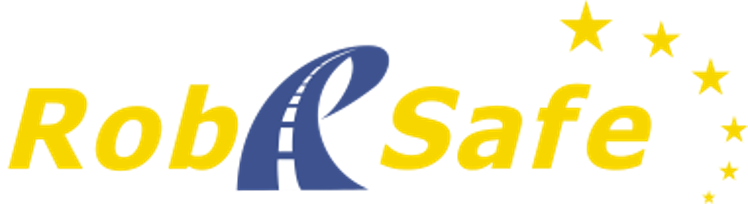
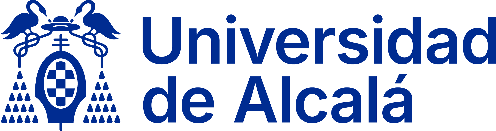

# rbsf-carla-irobocity

 &nbsp; 

ROS 2 + CARLA simulation stack developed at RobeSafe (UAH) for the iRobocity summer course.
It spawns an autonomous ego vehicle in CARLA, attaches a front camera and LiDAR, and publishes
sensor data as standard ROS 2 topics alongside a full TF tree and a 3D car model in RViz.

---

## Requirements

| Dependency | Version |
|---|---|
| Ubuntu | Above 24.04 |
| Docker | Compatible with NVIDIA Container Toolkit |
| NVIDIA GPU | Driver compatible with CUDA 12.9 |
| CARLA | 0.9.15 (downloaded by `setup_carla.sh`) |

---

## Installation

### 1. Download CARLA

Run the setup script once to download and unpack CARLA 0.9.15 (and the additional maps):

```bash
bash setup_carla.sh
```

This creates the `CARLA/` directory at the repo root.

### 2. Build the Docker image

```bash
make build
```

The image is based on `nvidia/cuda:12.9.1-devel-ubuntu22.04` and bundles:
- ROS 2 Humble (desktop)
- `uv` for Python environment management
- All Python dependencies from `pyproject.toml` (installed automatically on first shell start via `entrypoint.sh`)

### 3. Run the container

```bash
make run
```

The repo root is mounted at `/workspace` inside the container.
On first start `entrypoint.sh` runs `uv sync` to create the `.venv` and prints GPU/CUDA info.

### 4. Open additional terminals

To attach a new shell to the already-running container (e.g. for RViz, monitoring, etc.):

```bash
make attach
```

---

## Usage

Inside the container all commands are run from `/workspace`.

### Convenience aliases (defined in the image)

| Alias | Expands to |
|---|---|
| `BUILD` | `colcon build && source install/setup.sh` |
| `RUN_AGENT` | `BUILD` then `ros2 launch stack_launcher agent.launch.py` |
| `RUN_PERCEPTION` | `BUILD` then `ros2 launch stack_launcher perception.launch.py` |
| `RVIZ` | `rviz2 -d /workspace/rviz_cfg.rviz` |

### Step-by-step

**Terminal 1 — start CARLA server in the HOST**

```bash
./CARLA/CarlaUE4.sh -windowed -ResX=1280 -ResY=720
```

**Terminal 2 — build and launch the ROS 2 stack**

```bash
# Agent only (sensor bridge + RViz, no perception):
BUILD
ros2 launch stack_launcher agent.launch.py

# Full stack (agent + perception pipeline + RViz):
BUILD
ros2 launch stack_launcher perception.launch.py
```

Optional argument to control the number of traffic vehicles (default 50):

```bash
ros2 launch stack_launcher agent.launch.py traffic:=50
```

**Terminal 3 — open RViz** (`make attach` first)

```bash
RVIZ
```

---

## ROS 2 packages

### `carla_agent`

Main CARLA ↔ ROS 2 bridge.

| Topic | Type | Description |
|---|---|---|
| `/cam_front` | `sensor_msgs/Image` | Front RGB camera (640×480, 10 Hz) |
| `/cam_front/camera_info` | `sensor_msgs/CameraInfo` | Camera intrinsics |
| `/lidar` | `sensor_msgs/PointCloud2` | 32-channel LiDAR (50 m range) |
| `/tf_static` | TF | `map → ego → cam_front / lidar` |

The URDF car model (box + cylinder primitives) is installed under
`share/carla_agent/urdf/car.urdf` and loaded by `robot_state_publisher`.

The ego vehicle is a **Tesla Model 3** spawned with CARLA autopilot enabled.
The simulation runs in synchronous mode at 20 Hz (`fixed_delta_seconds = 0.05`).

#### Sensor specifications

| Sensor | Position (ego frame) | Resolution / Channels | FOV / Range | Rate |
|---|---|---|---|---|
| Camera (`cam_front`) | x=0, y=0, z=2.5 m | 640×480 px | 90° horizontal | 10 Hz |
| LiDAR (`lidar`) | x=0, y=0, z=2.5 m | 32 channels | 50 m | 20 Hz (320 000 pts/s) |

#### Exercises — `agent_unsolved.py`

Work through the six TODOs in `src/carla_agent/carla_agent/agent_unsolved.py`:

1. **Configure the sensors** (`SENSORS` dict) — fill in position, resolution, FOV, and LiDAR parameters.
2. **Connect to CARLA** (`__init__`) — create the client, set timeout, get the world.
3. **Camera intrinsics** (`_make_camera_info`) — derive focal length from FOV; compute the principal point.
4. **Create ROS 2 publishers** (`_attach_sensors`) — one `Image` publisher for the camera and one `PointCloud2` publisher for the LiDAR.
5. **Decode camera image** (`_publish_camera`) — reshape the BGRA byte buffer to (H, W, 4) and drop the alpha channel.
6. **Decode LiDAR scan** (`_publish_lidar`) — reshape the float32 buffer to (N, 4) and flip the X axis from CARLA left-handed to ROS right-handed coordinates.

The complete reference solution is in `src/carla_agent/carla_agent/agent.py`.

### `carla_perception`

Perception pipeline that fuses front-camera detections with the LiDAR point cloud.

#### Subscribed topics

| Topic | Type | Description |
|---|---|---|
| `/cam_front` | `sensor_msgs/Image` | Front RGB camera image |
| `/cam_front/camera_info` | `sensor_msgs/CameraInfo` | Camera intrinsics (read once at startup) |
| `/lidar` | `sensor_msgs/PointCloud2` | LiDAR point cloud |
| `/tf_static` | TF | `map → ego → cam_front / lidar` (extrinsics) |

#### Published topics

| Topic | Type | Description |
|---|---|---|
| `/segmented_image` | `sensor_msgs/Image` | Camera image with YOLOv8 detections overlaid |
| `/img_projected_lidar` | `sensor_msgs/Image` | Camera image with LiDAR points projected and depth-coloured (jet colormap) |
| `/painted_cloud` | `sensor_msgs/PointCloud2` | LiDAR cloud with extra `label` field (1 = inside a detection, 0 = background) |
| `/object_centers` | `visualization_msgs/MarkerArray` | 3D sphere markers at each detected instance's centroid |

#### Pipeline (10 Hz)

1. **YOLOv8 instance segmentation** — model `yolo26n-seg.pt`, confidence threshold 0.4, classes: person (0) and vehicles (1, 2, 3, 5, 6, 7).
2. **Mask merging** — per-instance binary masks are merged and resized to 640×480.
3. **LiDAR-to-image projection** — points are transformed from the LiDAR frame to the camera frame using the extrinsic matrix (from TF) composed with the intrinsic matrix K (from `camera_info`); out-of-bounds and behind-camera points are discarded.
4. **Semantic labelling** — each projected LiDAR point is labelled 1 if it falls inside the merged mask; published as `/painted_cloud`.
5. **Per-instance point extraction** — each YOLO instance mask is sampled at projected LiDAR pixel locations to collect the 3D points belonging to that instance.
6. **Outlier removal + centroid estimation** — Statistical Outlier Removal (k=10 neighbours, 2σ threshold) is applied per instance; the centroid of the surviving points is published as a sphere marker in `/object_centers`.

#### Exercises — `perception_node_student.py`

Work through the seven TODOs in `src/carla_perception/carla_perception/perception_node_student.py`:

1. **Subscribers** (`__init__`) — create subscriptions for `/cam_front` (Image) and `/lidar` (PointCloud2); wait for the first `camera_info` message and the TF transforms from camera and LiDAR frames to ego frame.
2. **Timer and publishers** (`__init__`) — configure the 10 Hz perception timer; create the four publishers listed above.
3. **YOLO inference + image message** (`timer_callback`, `_create_rgb_img_msg`) — call `self.segmentation_model()` with the correct arguments; fill in the six `Image` message fields.
4. **LiDAR projection + projected image** (`project_lidar_to_image`, `timer_callback`) — apply `lidar2cam`, filter behind-camera points, apply K; publish the depth-coloured projection image.
5. **Painted cloud** (`_create_painted_cloud_msg`, `timer_callback`) — build a `PointCloud2` with a `label` field and publish via `self.painted_cloud_publisher`.
6. **Per-instance masking + centroid markers** (`timer_callback`, `_make_centroid_marker`) — sample each instance mask at projected LiDAR pixel locations; compute the centroid and build and publish the `MarkerArray`.
7. **(Optional) SOR filter** (`_sor_filter`) — implement Statistical Outlier Removal using `KDTree` (k=10 neighbours, 2σ threshold) to remove noisy points from each instance cloud before centroid estimation.

The complete reference solution is in `src/carla_perception/carla_perception/perception_node.py`.

### `stack_launcher`

Two launch files, both accepting a `traffic` argument (default: **50** vehicles):

| Launch file | Nodes started |
|---|---|
| `agent.launch.py` | `carla_agent`, `robot_state_publisher`, `rviz2` |
| `perception.launch.py` | `carla_agent`, `carla_perception`, `robot_state_publisher`, `rviz2` |

---

## RViz setup

The pre-configured `rviz_cfg.rviz` at the repo root already has these displays saved.

1. Set **Fixed Frame** to `map`.
2. **Add → By display type → RobotModel** — set *Description Topic* to `/robot_description`.
3. **Add → By display type → Image** — set *Image Topic* to `/cam_front`.
4. **Add → By display type → PointCloud2** — set *Topic* to `/lidar`.
5. **Add → By display type → Image** — set *Image Topic* to `/segmented_image`.
6. **Add → By display type → Image** — set *Image Topic* to `/img_projected_lidar`.
7. **Add → By display type → PointCloud2** — set *Topic* to `/painted_cloud`.
8. **Add → By display type → MarkerArray** — set *Topic* to `/object_centers`.


---

## Repository layout

```
.
├── CARLA/                  # CARLA 0.9.15 binaries (created by setup_carla.sh)
├── deploy/
│   ├── Dockerfile          # Docker image definition
│   └── entrypoint.sh       # uv sync + env setup run on every shell start
├── src/
│   ├── carla_agent/        # CARLA ↔ ROS 2 bridge + URDF
│   ├── carla_perception/   # Perception pipeline
│   └── stack_launcher/     # Launch files
├── rviz_cfg.rviz           # Pre-configured RViz layout
├── setup_carla.sh          # One-time CARLA download script
├── Makefile                # build_image / run / attach targets
└── pyproject.toml          # Python dependencies (managed by uv)
```

---

## Authors

- Miguel Antunes-García
- Fabio Sánchez-García
- Santiago Montiel-Marín
- Rodrigo Gutiérrez-Moreno
